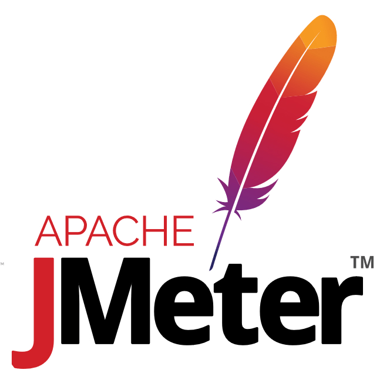

### Привет, меня зовут Дмитрий 👋

 

### 🧐 Обо мне
Уже около 7 лет занимаюсь тестированием это и WEB и платежное терминальное оборудование и ПО,💻
до этого 5 лет работал в процессинговом центре крупного банка внедрял различные линейки терминального оборудования.
Сейчас учитывая глобальные тендеции к автоматизации тестирования, активно изучаю это направление и уже подключился к работе над проектом API тестов платежных микросервисов.

### 🔨 Навыки и инструменты:

<code></code>
<code></code>
<code></code>
<code></code>
<code></code>
<code></code>
<code></code>
<code></code>
<code></code>

### 📈 моя статистика на гитхабе

 

<!--
**Kostoson/kostoson** is a ✨ _special_ ✨ repository because its `README.md` (this file) appears on your GitHub profile.

Here are some ideas to get you started:

- 🔭 I’m currently working on ...
- 🌱 I’m currently learning ...
- 👯 I’m looking to collaborate on ...
- 🤔 I’m looking for help with ...
- 💬 Ask me about ...
- 📫 How to reach me: ...
- 😄 Pronouns: ...
- ⚡ Fun fact: ...
-->

Привет! Меня Зовут Дмитрий
👋  Немного обо мне
Уже около 7 лет занимаюсь тестированием это и WEB и платежное терминальное оборудование и ПО,💻
до этого 5 лет работал в процессинговом центре крупного банка внедрял различные линейки терминального оборудования.
Сейчас учитывая глобальные тендеции к автоматизации тестирования, активно изучаю это направление и уже подключился к работе над проектом API тестов платежных микросервисов.

